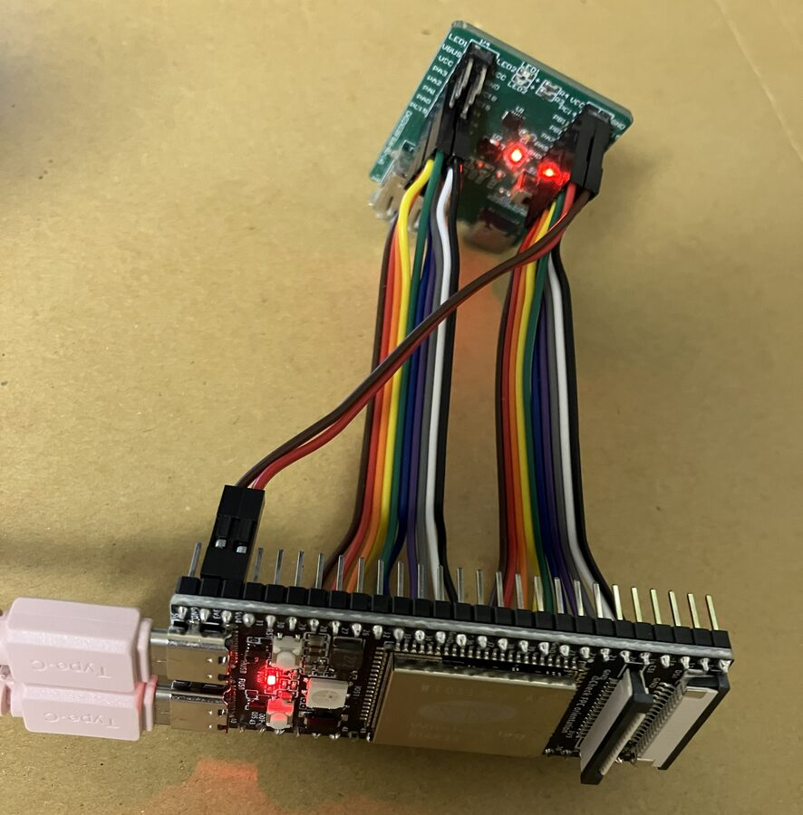

# OpenEmbeddedProbe（OEP の probe の Arduino ライブラリ）

[English](README.md)

## OEP とは

Open Embedded Probe（OEP）は、**probe**（開発中のチップにつなぐ小さな基板）と、PC の **host** のソフトウェアの間の、オープンな
プロトコルです。1 つの probe が、デバッガ（WCH の CH32 の RVSWD / SWIO、ARM の SWD）、target のコンソール、試験の治具（GPIO、
UART、SPI / I2C のデバイス、ロジックのキャプチャ）を兼ね、どの host（書き込みの道具、IDE のモニタ、pytest）も同じ方法で話します。

**プロトコルが定めるのは仕組みで、probe の能力は開いています。** OEP が定めるのは、要求と結果、ロック、発見の仕組みです。
何ができるかは開いています。

- probe は**自分にできることを宣言する**（名前で探すインターフェースと、そのピンや上限）。host はボードの表を持たず、probe が
  持つものに合わせて動く。
- 標準のインターフェース（`oep.wire.*`、`oep.target.*`、`oep.fixture.*` など）は oep-spec が定める。それとは別に、**誰でも
  自分のインターフェースを足せる**。自分の逆 DNS の名前（`io.github.<you>.<name>`、revision も自分で持つ）で出せば、誰の
  許可も要らない。知らない host は使わないだけである。このライブラリの ESP32 の SPI / I2C デバイスは、その拡張の例。
- **セッションのロック**で、2 つのプログラムが同時に probe を動かすのを防ぐ。
- **USB の vendor bulk、HID、USB CDC、USB-Serial/JTAG、UART bridge** のどれでも運べる。シリアルの口は、OEP のフレームと target の
  コンソールを 1 本で運ぶ。
- probe は線のことだけを知り、**target が何か**（flash の配置、ローダー、debug の線をどう動かすか）は **host が持つ**。

## 経路: なぜ OEP はいくつもの種類のリンクで動くのか

OEP のフレームはどのリンクでも同じで、違うのは包み方だけです（シリアルの口は COBS、USB の bulk と HID は長さ）。probe は自分の
チップが持つリンクのどれでも OEP を運べ（同時に複数でもよく、セッションとロックは 1 つを共有する）、host は見つかった中で一番速い
ものを選びます。どの種類も、それが要る probe があるので用意しています。

| リンク | 何に向くか | probe → host | host → probe | 往復 | このライブラリのチップ |
|---|---|---|---|---|---|
| **USB vendor bulk**（high speed） | ロジック・アナログのキャプチャのストリーミング、大きな flash の書き込み。2 チャネル 150 Msample/s のロジック（37.5 MB/s）に足りる唯一のリンク | 33〜37 MB/s | 5.5〜10 MB/s | 0.37 ms | ESP32-P4（HS の口） |
| **USB HID**（vendor 定義の report） | どの OS でもドライバ不要、ブラウザ（WebHID）からも開ける。**ソフトウェア（bit-bang）の USB デバイス**が出せる唯一の class: low speed のデバイスには bulk の endpoint が無いので、USB のペリフェラルを持たないチップで作った probe も HID なら OEP の probe になれる | 0.8〜1.1 MB/s（HS）。low speed のデバイスなら約 8 KB/s | 1.0 MB/s（HS） | 0.66 ms | ESP32-P4（HS の口） |
| **USB CDC**（シリアルの口） | COM ポートとして見える: Arduino IDE のポートとシリアルモニターがそのまま使え、target のコンソールが OEP と 1 本の線を共有する | 8.1 MB/s（HS） | 6.7 MB/s（HS） | 0.60 ms | ESP32-P4（HS の口）、RP2040 / RP2350（full speed） |
| **USB-Serial/JTAG**（ESP32 の内蔵のシリアルの口） | firmware に USB のスタックが要らない。同じ口で probe 自身を書き込める（esptool） | 約 0.8 MB/s（full speed） | — | — | ESP32-P4（FS の口）、ESP32-S3 / C3 / C6 |
| **UART**（USB-UART の変換チップ経由: CP2102、CH340 など） | UART と変換チップがあるボード（安いボードのほとんど）なら probe になれる。遅いが、小さな target の書き込みとデバッグには足りる | 約 11 KB/s（115200 baud） | 約 11 KB/s | 約 5 ms | classic ESP32 |

数値は試験台で測ったもの（ESP32-P4 は usbipd 経由、2026-09-25 / 26。classic ESP32 は 115200 baud。oep-spec の
docs/logic-capture.ja.md §2.7、docs/probe-cdc-and-persistence.ja.md §5.3 / §7）。low speed の HID の値は class そのものの上限
（8 byte の report、1 ms に 1 つ）で、測った値ではありません。

**なぜ probe に自分の USB の ID が要るのか**: host は USB のデバイスを 1 つずつ開かずに OEP の probe を見つけ、probe が持つどの
リンク（vendor bulk、HID、CDC）でも、同じ probe を 1 つのデバイス・1 つの serial number（= probe の `unit_id`）として扱います。
見分けのつかない既存のシリアルの口（USB-UART の変換チップの口、USB-Serial/JTAG の口、ほかのデバイスの VID:PID の CDC）は違います。
後ろに OEP の probe がいるかは、口を開いて OEP のフレームが返るかを試す（ネゴシエーションする）ほかに知る方法がありません。
任意のシリアルの口を開くと、その先にあるもの（DTR でリセットするボード、モデム、ほかのツールのデバイス）を乱しうるので、host が
すべての口について自動で試すことはできず、利用者がその口を明示的に選ぶ必要があります。
さらに上のリンクには、シリアルの口でない USB のデバイスが要ります（速さのための vendor bulk、ソフトウェア USB とブラウザのための
HID）。host が自動で OEP の probe と見分けるのはプロジェクトの USB の VID:PID だけで（まだ取得していない）、unit_id（USB の serial number）で
名指した probe は開いて describe で確かめます。それまでは iProduct が `OEP` で始まる device を暫定の手がかりとして、最初に confirm だけを
送って試すことがあります（oep-spec core §3.3、docs/usb-identity.ja.md）。
今は仮の USB の ID（ボードの既定の VID:PID。ESP32-P4 では `303a:0002`）で動かしていて、配布には使えません。専用の PID を
取得できたら、それに切り替える予定です。

UART の 115200 baud は、どのボードと変換チップでも通る速さです。それより速い速さを probe は前提にできません（921600 を安定して
通せない変換チップやボードがある）。host は、probe と host が合意しない限り 115200 のままにします。
classic ESP32 の firmware は任意の `port_speed`（oep-core §3.5）を持ちます: 頼んだ host は速さを試し、両方向の大きめの転送で
確かめてから、そのセッションの間その速さに決めます。確かめが来ない、フレームが壊れる、線が黙る、セッションが終わる、の
どれでも probe は自分で 115200 に戻ります（`-DOEP_PORT_SPEED=0` でビルドすると外れる）。

このライブラリは、ESP32-P4、classic ESP32、RP2350、RP2040 をその probe にします。

- 手引き: [使い始める](docs/guide/getting-started.ja.md)（焼く、見つける、Python から使う）、[probe を書く](docs/guide/writing-a-probe.ja.md)
  （ライブラリの中身、自分のインターフェース）、[ボード](docs/guide/boards.ja.md)（チップごとにできること、ほかのボード向けのビルド）。
- 仕様: [oep-spec](https://github.com/Open-Embedded-Probe/oep-spec)（英語の本文が正で、`.ja.md` はその訳。食い違えば英語が正しい）—
  まず [README](https://github.com/Open-Embedded-Probe/oep-spec/blob/main/README.ja.md) と [レビューの手引き](https://github.com/Open-Embedded-Probe/oep-spec/blob/main/docs/review-guide.ja.md) から。
  [使い始める](https://github.com/Open-Embedded-Probe/oep-spec/blob/main/docs/getting-started.ja.md) が最小の probe と host を作り、プロトコルの本体は
  [docs/oep-core.ja.md](https://github.com/Open-Embedded-Probe/oep-spec/blob/main/docs/oep-core.ja.md)、適合に要ることは
  [docs/conformance.ja.md](https://github.com/Open-Embedded-Probe/oep-spec/blob/main/docs/conformance.ja.md)、番号の表は [registry/oep-v1.toml](https://github.com/Open-Embedded-Probe/oep-spec/blob/main/registry/oep-v1.toml)。
- host のライブラリ: [oep-client-python](https://github.com/Open-Embedded-Probe/oep-client-python)（`pip install oep-client-python`、
  `oep` の命令、試験のための偽の probe）。
- USB の VID:PID: 今は仮の USB の ID（ボードの既定の VID:PID。ESP32-P4 では `303a:0002`）と `OEP` で始まる iProduct で動かしていて、
  配布には使えない。専用の PID を取得できたら、それに切り替える予定（[PID-USE.ja.md](PID-USE.ja.md)）。

## 配線: 回路図も、決まったピンの割り当ても無い

OpenEmbeddedProbe はファームウェアだけでできています。独自の基板や回路はありません。probe は、対応するマイコン（ESP32-P4、
classic ESP32、RP2040 / RP2350）の市販の開発ボードにこのファームウェアを書いたものなので、従うべき回路図がありません。決まった
ピンの割り当てもありません。

- **debug の線と GPIO の線は、空いている GPIO のどれにつないでもよい。** debug の線（RVSWD、SWIO、SWD）はどれもビットバンギング
  で動かし、GPIO の治具のピンも、要求ごとに host が選ぶ。ESP32 では UART、SPI、I2C の治具も GPIO マトリクスを通るので、これらも
  どのピンでもよい。
- **ピンが決まるのは、ハードウェアの周辺回路を使うときだけ。** RP2040 / RP2350 の UART の治具はチップの UART0 なので、RX / TX は
  GP1 / GP0、GP13 / GP12、GP17 / GP16、GP29 / GP28 のどれかにつなぐ。アナログのキャプチャはどのチップでも ADC のピン（RP2 は
  GP26〜28、ESP32-P4 は GPIO16〜23、classic ESP32 は GPIO32〜36 / 39）を使い、classic ESP32 の SWIO は GPIO32 より下の出力が
  要る。これらの線は、そのピンにつなぐ。チップごとの一覧は [ボード](docs/guide/boards.ja.md#リリースされた-firmware-のピン) にある。
- **target がどこにつながっているかは、host が探す。** oep-client-python の `oep pins` は、probe の pull をかけて probe が出す
  すべてのピンを読み、候補の上で debug の線を scan し、target を ID で見分け、リセットの線を見つける。最後に、保存する
  スロットを示す（oep-spec の host 開発ガイド §19。target ごとの記録は oep-spec の docs/target-scan-notes.ja.md）。
- **残りの線は、target を通して探せる。** debug の線がつながれば、host はその線を通して target 自身の GPIO を動かし、probe の
  どのピンが追いかけるかを見られる。そのため、target のほかの線（UART、電源のスイッチ、アプリケーションのピン）も、配線の表
  なしに同じやり方で見つかる。

なので、GND と target の debug のピン、ほかに使いたい線を、probe のボードの空いている GPIO に、順番を気にせずつなぎます。避ける
のは probe のボード自身のピンです。flash / PSRAM のピン、USB のピン、起動のモードを決めるピン、probe 自身の経路のピンは、
ファームウェアが出しません。チップごとの一覧は [ボード](docs/guide/boards.ja.md#リリースされた-firmware-のピン) にあります。信号の
電圧にも注意してください（[電気的な注意](#電気的な注意)）。

## 利用例: ESP32-P4 で CH32L103 を試験する



ESP32-P4 の基板 1 枚を、見たいピンをすべて CH32L103 につないでおけば、それだけで試験台になります。

- **target の書き込みとデバッグ**: RVSWD で書き込み、止める・走らせる・1 命令ずつ進める、メモリを読み書きする
  （`oep.wire.rvswd`、`oep.target.riscv-dm`）。[ArduinoCore-CH32RV](https://github.com/ch32-riscv-ug/ArduinoCore-CH32RV) なら、Arduino IDE から
  probe 経由で書き込める（`oep://...` のポート）。
- **コンソールを読む**: debug module 経由（`oep.target.console`、UART 不要）か UART（`oep.fixture.uart`）。
- **target のコードがピンで何をしているかを確かめる**: P4 が相手側のデバイス（SPI のデバイス、I2C のデバイス）として受けるので、
  target のドライバが本当に送ったバイトを試験で見られる。GPIO や UART で target に返すこともできる（`oep.fixture.gpio` / `uart`、
  `oep.fixture.spi-target` / `i2c-target`）。
- **最大 16 ピンを同時にキャプチャ**: SPI のデバイスとして動かしながらでも取れる（`oep.fixture.logic`、P4 の PARLIO）。

  | ch 数 | サンプリング |
  |---:|---:|
  | 2 | 160 Msps |
  | 8 | 40 Msps |
  | 16 | 20 Msps |

  どのピンをキャプチャするかは要求ごとに選ぶ（plan）。試験項目ごとに必要なピンだけを取れ、試験の間に配線も firmware も変えなくて
  よい。取ったサンプルは sigrok のセッションファイル（`LogicCapture.to_sr`、PulseView で開ける）や、
  [WireSkein](https://github.com/Open-Embedded-Probe/wireskein) のような実行記録に渡せるので、結果だけでなく信号のレベルで試験できる。

上のことはすべて、実行中に host が選びます。同じ firmware が、どの試験にも使えます。

## 電気的な注意

このライブラリは信号のレベルに関与しません。probe のピンは MCU のピンそのものです。

- ESP32-P4 は 3.3 V 系。5 V 系の target につなぐときは、間に**双方向で高速に動くレベルコンバータ**などを入れる。
- 受けるだけの線（キャプチャなど）は、間に**高速なバッファ**を入れれば 5 V 系とつなげる。
- 入力の前に**高速なコンパレータ**を置けば、レベルの判定を可変にできる。ESP32-P4 は可変の LDO を持つので、その判定の電圧に
  外付けの部品は要らない。

## このライブラリ

Open Embedded Probe（OEP）の probe を Arduino で書くためのライブラリと、各 probe のファームウェア（`examples/`）。
v1（oep-spec の `docs/oep-core.ja.md` と標準インターフェースの `docs/oep-if-*.ja.md`）を話す。凍結の前の v1 で、凍結までは仕様が壊れることがある。破壊的変更を前提とする実験段階で、互換は約束しない。

wire 上の数値は oep-spec の `registry/oep-v1.toml` が唯一の定義で、その生成物を `src/OepRegistry.h` に写している。

## 構成

| PATH | 中身 |
|---|---|
| `src/Oep.h`、`src/OepEndpoint.*`、`src/OepRegistry.h` | v1 の本体（oep-core）: フレーム、名前で探すインターフェース、ロック、複数の経路（describe の transport）、シリアルの口の共用（core §3.4）、plan、通知 |
| `src/OepBind.*` | シリアルの口に流すもの（bind: last-reset / manual / mixed、セッション中の停止と最後の reset からの再開） |
| `src/OepStream.h`、`src/OepDebug.h` | 標準インターフェースの共通部品（位置つきのストリーム、線と target の status とピンの組） |
| `src/OepTarget.*`、`src/OepSwd.*`、`src/OepConsole.*`、`src/OepFixture.*`、`src/OepCapture.*`、`src/OepSampler.*`、`src/OepConfig.*` | 標準インターフェース: 線と target（`oep.wire.rvswd` / `swio` / `swd`、`oep.target.riscv-dm` / `arm-adi`）、コンソール、fixture（gpio / uart / capture）、`oep.probe.config`（スロット、bind。ESP32 は NVS、RP2040 / RP2350 は flash に保存）。各ファイルの冒頭に対応する仕様の節がある |
| `src/OepP4I2cTarget.*`、`src/OepP4SpiTarget.*` | 標準インターフェース `oep.fixture.i2c-target` / `spi-target`（revision 1、ESP-IDF の I2C / SPI スレーブで実装。2026-09-30 までは独自の `io.github.ch32-riscv-ug.esp32.*`） |
| `src/OepCh32Dm.*`、`src/OepRvswdPhy.*`、`src/OepSwioPhy.*`、`src/OepDmConsole.*`、`src/OepPinTable.h`、`src/OepPlatform.h`、`src/OepFrame.*` など | 部品（CH32 のデバッグモジュール、線の物理層、コンソールの framing、ピンの表と空きの状態、Arduino の core の差、フレーム） |
| `examples/` | ボードの firmware と学ぶための example: [Example](#example) を参照 |
| `tests/host/` | 移植できる部分（シリアルの口の読み、endpoint の共用の規則、bind）の host の試験: `tests/host/run.sh`（g++） |
| `tools/sync_registry.sh` | oep-spec の `generated/oep-v1/oep_v1_registry.h` を `src/OepRegistry.h` に写す |
| `tools/bump_version.py`、`tools/sync_release_assets.py`、`.github/workflows/release.yml` | リリース（arduino-library-release-toolkit のものをそのまま使う。編集しない） |
| `docs/guide/` | 手引き（英語と日本語）: 使い始める、probe を書く、ボード |
| `docs/` | そのほか: example の並べ方の案と、日付入りの作業記録（経緯） |

## Example

Arduino IDE の `ファイル > スケッチ例 > OpenEmbeddedProbe` から開くか、`sketch.yaml` の profile でビルドする
（`arduino-cli compile --profile <profile> <dir>`）。どのスケッチも、冒頭のコメントに説明と、host からの使い方がある。

| Example | ボード（profile） | 示すこと |
|---|---|---|
| `Firmware/OepProbe` | Pico / Pico 2 ほか RP2040 / RP2350 のボード（rp2040、rp2350）、ESP32-P4（esp32p4）、classic ESP32（esp32） | **焼く firmware**（Releases にもある）: そのチップでできることを全部入れ、ピンはすべて host が選ぶ。治具 = その設定 |
| `01.Basics/MinimalProbe` | RP2040 / RP2350、classic ESP32 | 最小の probe: oep.core だけ。endpoint、経路、describe |
| `01.Basics/FixtureProbe` | RP2040 / RP2350、classic ESP32 | 試験の治具: host が plan で決めるピンの GPIO と UART（ピンの表、持ち主、plan） |
| `02.Interfaces/CustomInterface` | RP2040 / RP2350、classic ESP32 | **OEP の拡張**: 自分の名前で自分のインターフェース。describe、plan、op、TLV の後ろの部分 |
| `03.Transports/MultipleTransports` | ESP32-P4 | 1 つの endpoint を 4 つの USB の経路で同時に（HS vendor bulk、HID、CDC、USB-Serial/JTAG）、USB の名乗り |
| `04.Debug/RvswdDebugProbe` | RP2040 / RP2350、ESP32-P4 | RVSWD の CH32 のデバッガ: wire、riscv-dm、コンソール |
| `04.Debug/SwioDebugProbe` | classic ESP32 | 1 本線の SWIO の CH32V00x のデバッガ |
| `04.Debug/SwdDebugProbe` | RP2040 / RP2350 | SWD の ARM のデバッガ: wire、arm-adi |
| `05.Capture/LogicCapture` | ESP32-P4 | 全速のロジアナ（16 ch まで、2 ch で 160 Msps）、HS でストリーミング。`host/stream_test.py` 付き |
| `06.Settings/ProbeConfig` | RP2040 / RP2350 | 起動時に自分で準備する治具: スロット、bind（target のコンソールを probe の口に）、plan、空きのときの状態。flash に保存 |
| `Tools/SwdPinSurvey` | RP2040 / RP2350 | 立ち上げの道具（Serial に文字で出す。OEP ではない）: どのピンが debug port か |

## 使い始める

短い版です。[手引き](docs/guide/getting-started.ja.md)に続きがあります（GPIO / UART、デバッグ、キャプチャ、設定）。

1. **firmware**: [Releases](https://github.com/Open-Embedded-Probe/oep-probe-arduino/releases) のビルド済みを使う
   （どの RP2040 / RP2350 のボードにも `OepProbe-rp2040-<version>.uf2` / `OepProbe-rp2350-<version>.uf2` を BOOTSEL のボードに
   コピー。ESP32-P4 / classic ESP32 は `OepProbe-esp32p4-<version>.merged.bin` / `OepProbe-esp32-<version>.merged.bin`。ピンは host が選ぶ。ESP32 は `<Example>-<profile>-<version>.merged.bin` を `esptool.py write_flash 0x0 <file>`。sha256 は
   `firmware-<version>.json`）。自分でビルドするなら、Arduino のライブラリマネージャーで
   **OpenEmbeddedProbe** を入れ、`ファイル > スケッチ例 > OpenEmbeddedProbe` を開き、その `sketch.yaml` の profile（core の版と
   ライブラリを固定してある）でビルドする:

   ```sh
   arduino-cli compile --clean --profile esp32p4 examples/Firmware/OepProbe
   arduino-cli upload -p <port> --profile esp32p4 examples/Firmware/OepProbe
   ```

   firmware は**使う前に転送する**（ボードに何が入っているかは分からない）。
2. **host**: `pip install oep-client-python` の後、probe が何を持つかを見る:

   ```sh
   oep dump --port <port>
   ```

   Python からは `oep_client.link.open_host(<port>)` でセッションを得る。シリアルの口（USB-Serial/JTAG、USB CDC、UART bridge）は
   OEP のフレーム（`0x00 <COBS> 0x00`）と bind の生のバイトを 1 本で運ぶ。host は排他（TIOCEXCL）で開き、フレームの外は雑音として
   捨てる（oep-spec の host 開発ガイド §1、§2）。
3. **設定**: 起動時から target のコンソールをシリアルの口に流すには、スロットと bind を登録する（`oep.probe.config`、ESP32 は
   NVS、RP2040 / RP2350 は flash に保存）。線の設定は target のもので、host が渡す（CH32L103 は、休ませる間は SWCLK を low、reset 直後は 1 MHz まで）:

   ```sh
   oep config slot <probe> --name l103 --wire rvswd --pins 2,54 --attach at-boot --retry 1 --mechanism dmseq \
       --max-speed 1000000 --idle-clock low
   oep config bind <probe> --port 1 --mode last-reset --stream slot:l103 --save
   oep config show <probe>
   ```

## 既知の罠

- Arduino.h は `word(...)` を `makeWord(...)` の macro にしている。lambda や関数を `word` と名付けると引数がそのまま返る。
- ESP32-P4 の `RvswdPhy::begin` の後に同じピンへ `pinMode` / `digitalWrite` を使うと、dedicated GPIO の束から外れて戻らない（chip の reset が要る）。
- direct build（`build_opt.h` で EspUsbDevice の vendor を直接書く形）のスケッチは、`build_opt.h` を変えたら `--clean` でビルドする。
- vendor bulk の OUT は packet ごとに受ける（`CFG_TUD_VENDOR_RX_NEED_ZLP=0`）。16 KiB の転送で受けて ZLP で終わらせる形
  （`=1`）では、ちょうど 512 byte の倍数で終わる要求（1024 byte の write_block など）の完了が、P4 では次の OUT が来るまで
  遅れ、probe は 3 s 答えなかった（2026-09-30、X035 の治具）。

## リリース

[arduino-library-release-toolkit](https://github.com/tanakamasayuki/arduino-library-release-toolkit) の共通の仕組みをそのまま使う。
変更は `CHANGELOG.md` の `## Unreleased` に (EN) / (JA) で書き足し、GitHub Actions の Release（workflow_dispatch）を起動すると、
`library.properties` の版を上げ、`src/openembeddedprobe_version.h` を作り、`release` ブランチで example の `sketch.yaml` の `dir: ../..` を
`OpenEmbeddedProbe (<版>)` に書き換え、`tests/` を除いた ZIP、tag、GitHub Release を作る。続けて、別の `.github/workflows/firmware.yml`（toolkit のものではない）が
tag から各 example の各 profile をビルドし、`<Example>-<profile>-<version>.merged.bin`（ESP32、0x0 に書く）/ `.bin`（ESP32、更新用の app の image。P4 の DFU）/ `.uf2`（RP2040 / RP2350）と
`firmware-<version>.json`（sha256）を Release に付ける（付けるのは `examples/Firmware/` の分だけ。ほかの example は確かめるためにビルドする）。probe は同じ版を describe の firmware の文字列で返す。

### Release の添付

`firmware-<version>.json` はこのリポジトリの決まり（OEP の規範ではない。oep-spec の凍結の決定 9）:

```json
{"schema": 1, "library": "OpenEmbeddedProbe", "version": "0.0.20", "firmware": [
  {"example": "Firmware/OepProbe", "profile": "esp32p4", "file": "OepProbe-esp32p4-0.0.20.bin", "kind": "app",
   "model": "esp32p4", "fqbn": "esp32:esp32:esp32p4:...", "flash_offset": null, "sha256": "..."}]}
```

| フィールド | 意味 |
|---|---|
| `schema` | 1。読む側は違う番号を断る。フィールドは足すだけ |
| `kind` | `merged`（ESP32、`flash_offset` 0 から書く全体）、`app`（ESP32、app の image。もう片方の app の区画への更新、P4 の DFU）、`uf2`（RP2040 / RP2350） |
| `model` | この image が describe の model で返す値（`esp32p4`、`esp32`、`rp2040`、`rp2350`）。ビルドの対象のチップ。describe の chip の TLV は別もので、動いている部品の `<model> v<rev>` |
| `fqbn`、`flash_offset` | ビルドに使ったもの。`merged` を書く位置（ほかは `null`） |
| `sha256` | ファイルの sha256 |

このライブラリでビルドした sketch の describe の firmware の文字列は、ライブラリのリリースの版（`0.0.20`、
`OPENEMBEDDEDPROBE_VERSION_STR`）で、Release と上の `version` と同じ。作業中の tree からのビルドは `library.properties`
の版を返す。OEP は文字列を決めていない（core §7.5）。これはこのリポジトリの決まり。

## ライセンス

MIT（[LICENSE](LICENSE)）。各ソースファイルにも表記がある（`SPDX-License-Identifier: MIT`）。USB の VID:PID はこれに含まれない:
[PID-USE.ja.md](PID-USE.ja.md)。
